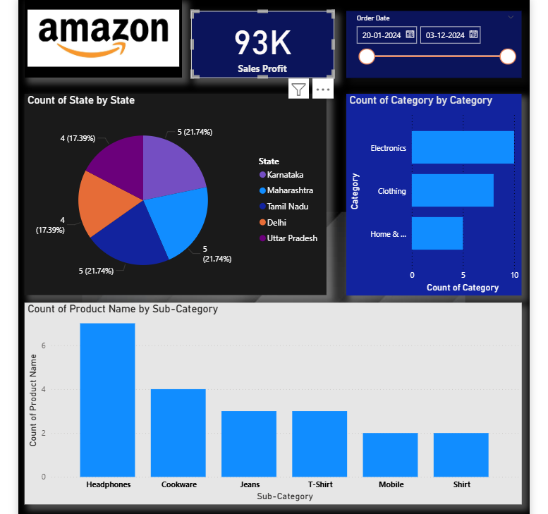

# Amazon-Sales-Analysis-Dashboard
An Amazon sales dashboard visualizing profit, category distribution, state-wise performance, and product trends for quick business insights.

# 🛒 Amazon Sales Analytics Dashboard

  

  
  
  

---

## 📌 Project Overview

The **Amazon Sales Analytics Dashboard** is an interactive Power BI report designed to track and analyze Amazon's sales data across Indian states, product categories, and sub-categories. It provides a comprehensive view of order distribution, category performance, and product-level insights — helping business analysts and e-commerce managers make **smarter, data-driven decisions**.

---

## 🎯 Objectives

- Monitor **total order volume** across the selected date range
- Analyze **state-wise order distribution** across India
- Understand **category-wise sales performance** (Electronics, Clothing, Home)
- Identify **top-selling sub-categories** and product names
- Enable **date-range filtering** for flexible time-period analysis

---

## 📊 Dashboard Features

| Visual | Description |
|---|---|
| 🔢 **KPI Card** | Total Orders — **93K** for the selected period |
| 🥧 **Count of State by State (Pie Chart)** | Order share by state: Karnataka, Maharashtra, Tamil Nadu, Delhi, Uttar Pradesh — each ~17–22% |
| 📊 **Count of Category by Category (Bar Chart)** | Electronics (~10), Clothing (~7), Home (~5) |
| 📉 **Count of Product Name by Sub-Category** | Headphones (top), Cookware, Jeans, T-Shirt, Mobile, Shirt |
| 📅 **Order Date Slicer** | Date range filter: **20-01-2024 to 03-12-2024** |
| 🔽 **Filter / Bookmark Controls** | Interactive filter and view toggle buttons |

---

## 🧠 Key Insights

1. **93K total orders** recorded — indicating high sales volume in the period.
2. **Five states** (Karnataka, Maharashtra, Tamil Nadu, Delhi, UP) share orders nearly equally at ~17–22% each.
3. **Electronics** is the top-performing category, followed by Clothing and Home.
4. **Headphones** is the most ordered sub-category, significantly ahead of others.
5. Dashboard spans nearly **11 months (Jan–Dec 2024)** — a full-year perspective.
6. **Mobile and Shirt** are least ordered — opportunity for promotions.

---

## 🛠️ Tools & Technologies

- **Power BI Desktop** — Dashboard design and visualization
- **Microsoft Excel / CSV** — Source data preparation
- **DAX (Data Analysis Expressions)** — KPI measures and calculations
- **Power Query** — Data cleaning and transformation

---

## ❓ Dashboard Q&A

<b>Q1. What is the total number of orders?</b>

**Answer:** **93K orders** — shown in the KPI card at the top center.

<b>Q2. Which states are covered?</b>

**Answer:** Karnataka, Maharashtra, Tamil Nadu, Delhi, and Uttar Pradesh — each ~17–22%.

<b>Q3. Which state has the highest order share?</b>

**Answer:** **Karnataka and Maharashtra** both at **21.74%**.

<b>Q4. Which category has the most orders?</b>

**Answer:** **Electronics** leads (~10 count), followed by Clothing (~7) and Home (~5).

<b>Q5. Top sub-category by product count?</b>

**Answer:** **Headphones** — highest bar in the sub-category chart (~6).

<b>Q6. What is the dashboard date range?</b>

**Answer:** **20th January 2024 to 3rd December 2024**.

<b>Q7. Which sub-categories have the least orders?</b>

**Answer:** **Mobile** and **Shirt** — lowest counts among all sub-categories.

---

## 📸 Preview

---

Built with 💛 to decode Amazon's sales story across India

